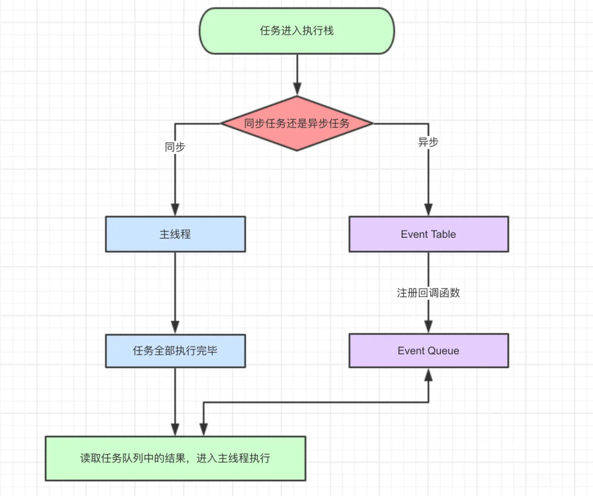

# vue3学习

## Ref全家桶

### 1.isRef

作用: 判断是不是一个ref对象

```javascript
import { ref, Ref,isRef } from 'vue'
let message: Ref<string | number> = ref("我是message")
let notRef:number = 123
const changeMsg = () => {
  message.value = "change msg"
  console.log(isRef(message)); //true
  console.log(isRef(notRef)); //false
  
}
```

### 2.shallowRef

- 作用： 创建一个跟踪自身.value变化的ref，但不会使其值也变成响应式
- 个人理解：对基本数据类型，比如说number，string 是可以监听到，Object这种则不可以监听到
- 修改对象其属性是非响应式的这样是不会改变的，但直接修改value则是可以监听到
- 建议： ref和shallowRef不能一块写，不然会影响shallowRef造成视图得更新

```vue
<template>
  <div>
    <button @click="change">change</button>
      {{ msg }}
  </div>
</template>
<script setup lang="ts">
import { ref,shallowRef } from 'vue'
type sampleObj = {
  name:string
}
  let msg = shallowRef<sampleObj>({name:'小何'})
  const change= ()=>{
    msg.value.name = '小小' //直接修改对象属性不可以监听到
    console.log(msg)
  }

</script>
<style scoped>
</style>

```

```vue
<template>
  <div>
    <button @click="change">change</button>
      {{ msg.name }}
  </div>
</template>
<script setup lang="ts">
import { ref,shallowRef } from 'vue'
type sampleObj = {
  name:string
}
  let msg = shallowRef<sampleObj>({name:'小何'})
  const change= ()=>{
    msg.value = { name:'小小' } //修改对象
    console.log(msg)
  }

</script>
<style scoped>
</style>
```

### 3.triggerRef 

- 作用：强制更新页面DOM
- 使用了这个方法，shallowRef也会改变值

```vue
<template>
  <div>
    <button @click="change">change</button>
      {{ msg }}
  </div>
</template>
<script setup lang="ts">
import { ref,shallowRef } from 'vue'
type sampleObj = {
  name:string
}
  let msg = shallowRef<sampleObj>({name:'小何'})
  const change= ()=>{
    msg.value.name = '小小'
    triggerRef(msg)  //强制视图更新
    console.log(msg)
  }

</script>
<style scoped>
</style>

```

### 4.ref

- 接受一个内部值并返回一个**响应式**且可变的 ref 对象。ref 对象仅有一个 `.value` property，指向该内部值。

### 5.customRef

- 自定义ref
- customRef 是个工厂函数要求我们返回一个对象 并且实现 get 和 set 适合去做防抖之类的

```typescript
function myRef<T = any>(value: T) {
  let timer:any;
  return customRef((track, trigger) => {
    return {
      get() {
        track()
        return value
      },
      set(newVal) {
        clearTimeout(timer)
        timer =  setTimeout(() => {
          console.log('触发了set')
          value = newVal
          trigger()
        },500)
      }
    }
  })
}
```

## reactive全家桶

### 1. reactive

- 用来绑定复杂的数据类型 例如 对象 队组

- vue已经做了泛型约束 `T extends object`

- 不可以绑定普通类型，否则会报错

- 数组不可直接赋值，如直接赋值页面不会变化，因为会脱离响应式

  解决方案：

  方案1

  ```javascript
  
  let person = reactive<number[]>([])
  setTimeout(() => {
    //person = [1, 2, 3] //不可直接赋值
    person.push(...arr) // 方案1 使用push
    console.log(person);
    
  },1000)
  ```

  方案2

  ```javascript
  type Person = {
    list?:Array<number>
  }
  //使用对象包裹
  let person = reactive<Person>({
     list:[]
  })
  setTimeout(() => {
    const arr = [1, 2, 3]
    person.list = arr;
    console.log(person);
    
  },1000)
  ```

### 2. readonly

- 拷贝一份proxy对象设置为只读

```javascript
import { reactive ,readonly} from 'vue'
const person = reactive({count:1})
const copy = readonly(person)
//person.count++
copy.count++
```

### 3.shallowReactive

> 只能对浅层的数据 如果是深层的数据只会改变值 不会改变视图

## to全家桶

### 1.toRef

- 将原始对象转成响应式对象
- 但原始对象是非响应式的就不会更新视图，但数据是会变
- 如果原始对象是响应式，则会更新视图并改变数据

```vue
<template>
  <div>
    <button @click="change">change</button>
    {{ state }}
  </div>
</template>
<script setup lang="ts">
import { toRef } from 'vue'
const sampleObj = {
  name: '喵呼',
  age: 18
}
const state = toRef(sampleObj, 'age')
const change = () => {
  state.value++
  console.log(state)
}
</script>
<style scoped></style>
```

### 2.toRefs

- 批量创建ref对象，方便解构使用

```javascript
import { toRef,reactive, toRefs } from 'vue'
const sampleObj = reactive({
  name: '喵呼',
  age: 18
})
let {name,age } = toRefs(sampleObj)
age.value++
```

### 3.toRaw

- 将响应式对象转为普通对象

```javascript
import { toRef,reactive, toRefs } from 'vue'
const sampleObj = reactive({
  name: '喵呼',
  age: 18
})
const obj = toRaw(sampleObj)
```

## computed计算属性

> 计算属性就是当依赖的属性的值发生变化的时候，才会触发他的更改，如果依赖的值，不发生变化的时候，使用的是缓存中的属性值。

1. 函数形式

```javascript
import { computed, reactive, ref } from 'vue'
let price = ref(0)//$0
let m = computed<string>(()=>{
   return `$` + price.value
})
price.value = 500
```

2. 对象形式

```javascript
import { computed, ref } from 'vue'
let price = ref<number | string>(1)//$0
let mul = computed({
   get: () => {
      return price.value
   },
   set: (value) => {
      price.value = 'set' + value
   }
})
```

## watch侦听器

### watch

> `watch` 需要侦听特定的数据源，并在单独的回调函数中执行副作用

> watch第一个参数监听源
>
> watch第二个参数回调函数cb（newVal,oldVal）
>
> watch第三个参数一个options配置项是一个对象{
>
> immediate:true //是否立即调用一次
>
> deep:true //是否开启深度监听
>
> }

1. 监听单个和多个ref案例

```javascript
//watch(message, (newVal, oldVal) => { 单个值
watch([message,message2], (newVal, oldVal) => { //多个则为数组
    console.log('新的值----', newVal);
    console.log('旧的值----', oldVal);
},{
    immediate:true,
    deep:true
})
```

2. 监听reactive

```javascript
import { ref, watch ,reactive} from 'vue'
let message = reactive({
    nav:{
        bar:{
            name:""
        }
    }
})
watch(message, (newVal, oldVal) => {
    console.log('新的值----', newVal);
    console.log('旧的值----', oldVal);
})

//监听 单一值用函数返回对象的值
//let message = reactive({
//   name:"",
//   name2:""
//})
//watch(()=>message.name, (newVal, oldVal) => {
//    console.log('新的值----', newVal);
//    console.log('旧的值----', oldVal);
//})
```

## watchEffect高级侦听器

> 立即执行传入的一个函数，同时响应式追踪其依赖，并在其依赖变更时重新运行该函数。
>
> 如果用到message 就只会监听message 就是用到几个监听几个 而且是非惰性 会默认调用一次

```javascript
let message = ref<string>('')
let message2 = ref<string>('')
 watchEffect(() => {
    //console.log('message', message.value);
    console.log('message2', message2.value);
})
```

1. 清除副作用

> 在触发监听之前会调用一个函数可以处理你的逻辑例如防抖

```javascript
import { watchEffect, ref } from 'vue'
let message = ref<string>('')
let message2 = ref<string>('')
 watchEffect((oninvalidate) => {
    //console.log('message', message.value);
    oninvalidate(()=>{
        
    })
    console.log('message2', message2.value);
})
```

2. 停止跟踪

> watchEffect 返回一个函数 调用之后将停止更新

```javascript
const stop =  watchEffect((oninvalidate) => {
    //console.log('message', message.value);
    oninvalidate(()=>{
    })
    console.log('message2', message2.value);
},{
    flush:"post",
    onTrigger () {
    }
})
stop()
```

3. 更多配置项

|          | pre                | sync                 | post           |
| -------- | ------------------ | -------------------- | -------------- |
| 更新时机 | 组件**更新前**执行 | 强制效果始终同步触发 | 组件更新后执行 |

> onTrigger  可以帮助我们调试 watchEffect

```javascript
import { watchEffect, ref } from 'vue'
let message = ref<string>('')
let message2 = ref<string>('')
 watchEffect((oninvalidate) => {
    //console.log('message', message.value);
    oninvalidate(()=>{
 
    })
    console.log('message2', message2.value);
},{
    flush:"post",
    onTrigger () {
        
    }
})
```

## 生命周期

> setup语法糖中 beforCreate和created没有这两个生命周期的，使用setup去代替


| 选项式API       | 组合式API         |
| --------------- | ----------------- |
| beforeCreate    | Not needed        |
| created         | Not needed        |
| beforeMount     | onBeforeMount     |
| mounted         | onMounted         |
| beforeUpdate    | onBeforeUpdate    |
| updated         | onUpdated         |
| beforeUnmount   | onBeforeUnmount   |
| unmounted       | onUnmounted       |
| errorCaptured   | onErrorCaptured   |
| renderTracked   | onRenderTracked   |
| renderTriggered | onRenderTriggered |
| activated       | onActivated       |
| deactivated     | onDeactivated     |

## 父子组件传参

>使用defineProps接收给的参数
>
>使用defineEmits派发一个事件

```javascript
//TS
defineProps<{
    title:string,
    data:number[]
}>()
//js
defineProps({
    title:{
        default:"",
        type:string
    },
    data:Array
})
const emit = defineEmits(['on-click'])
//ts
// const emit = defineEmits<{
//     (e: "on-click", name: string): void
// }>()
const clickTap = () => {
    emit('on-click', list)
}
```

## 动态组件

> 来回切换的场景，比如说tab界面

```vue
<!-- currentTab 改变时组件也改变 -->
<component :is="tabs[currentTab]"></component>
```


注意事项

> 在Vue2 的时候is 是通过组件名称切换的 在Vue3 setup 是通过组件实例切换的

> 如果你把组件实例放到Reactive Vue会给你一个警告runtime-core.esm-bundler.js:38 [Vue warn]: Vue received a Component which was made a reactive object. This can lead to unnecessary performance overhead, and should be avoided by marking the component with `markRaw` or using `shallowRef` instead of `ref`. 
> Component that was made reactive: 
>
> 这是因为reactive 会进行proxy 代理 而我们组件代理之后毫无用处 节省性能开销 推荐我们使用shallowRef 或者  markRaw 跳过proxy 代理

```vue
const tab = reactive<Com[]>([{
    name: "A组件",
    comName: markRaw(A)
}, {
    name: "B组件",
    comName: markRaw(B)
}])
```

## 异步组件

> 在大型项目中，我们可能需要拆分应用为更小的块，并仅在需要时再从服务器加载相关组件。

```javascript
import { defineAsyncComponent } from 'vue'

const AsyncComp = defineAsyncComponent(() => {
  return new Promise((resolve, reject) => {
    // ...从服务器获取组件
    resolve(/* 获取到的组件 */)
  })
})
// ... 像使用其他一般组件一样使用 `AsyncComp`

//ES动态模块也是返回一个Promise所以可以这样导入
//const AsyncComp = defineAsyncComponent(() =>
//  import('./components/MyComponent.vue')
//)
```

```javascript
const AsyncComp = defineAsyncComponent({
  // 加载函数
  loader: () => import('./Foo.vue'),

  // 加载异步组件时使用的组件
  loadingComponent: LoadingComponent,
  // 展示加载组件前的延迟时间，默认为 200ms
  delay: 200,

  // 加载失败后展示的组件
  errorComponent: ErrorComponent,
  // 如果提供了一个 timeout 时间限制，并超时了
  // 也会显示这里配置的报错组件，默认值是：Infinity
  timeout: 3000
})

```

> 搭配Suspense使用 - 还在实验性阶段

## Teleport传送组件

> vue3 新特性
>
> `<Teleport>` 是一个内置组件，它可以将一个组件内部的一部分模板“传送”到该组件的 DOM 结构外层的位置去。
>
> 使用to来指定目标,支持id class 等选择器
>
>  `<Teleport :disabled="isMobile">`
>
> 使用disabled禁用teleport

```vue
<button @click="open = true">Open Modal</button>

<!-- 使用to来指定目标 -->
<Teleport to="body"> 
  <div v-if="open" class="modal">
    <p>Hello from the modal!</p>
    <button @click="open = false">Close</button>
  </div>
</Teleport>

```

## 组合式 API：依赖注入

> provide 可以在祖先组件中指定我们想要**提供**给后代组件的数据或方法，而在任何后代组件中，我们都可以使用 inject 来接收 provide **提供**的数据或方法。 

父组件传递数据

```vue
<template>
    <div class="App">
        <button>我是App</button>
        <A></A>
    </div>
</template>
    
<script setup lang='ts'>
import { provide, ref } from 'vue'
import A from './components/A.vue'
let flag = ref<number>(1)
provide('flag', flag)
</script>
    
<style>
.App {
    background: blue;
    color: #fff;
}
</style>
```

子组件接受

```vue
<template>
    <div style="background-color: green;">
        我是B
        <button @click="change">change falg</button>
        <div>{{ flag }}</div>
    </div>
</template>
    
<script setup lang='ts'>
import { inject, Ref, ref } from 'vue'
 
const flag = inject<Ref<number>>('flag', ref(1))
const change = () => {
    flag.value = 2
}
</script>
    
<style>
</style>
```

> Tips:你如果传递普通的值 是不具有响应式的 需要通过ref reactive 添加响应式
>
> 使用场景
>
> 当父组件有很多数据需要分发给其子代组件的时候， 就可以使用provide和inject。

## 兄弟传参和Event Bus

> 兄弟组件传参

1. 可以通过派发时间然后通过Props传递可以实现，但比较麻烦

2. Event bus

   > 我们在Vue2 可以使用$emit 传递 $on监听 emit传递过来的事件
   >
   > 这个原理其实是运用了JS设计模式之发布订阅模式

## TSX

> 一个类似于react开发的代码


## 自定义指令directive

> 除了 Vue 内置的一系列指令 (比如 `v-model` 或 `v-show`) 之外，Vue 还允许你注册自定义的指令

```vue
<script setup>
// 在模板中启用 v-focus
const vFocus = {
  mounted: (el) => el.focus()
}
</script>

<template>
  <input v-focus />
</template>

```

> 将一个自定义指令注册到全局

```javascript
const app = createApp({})
// 使 v-focus 在所有组件中都可用
app.directive('focus', {
  /* ... */
})
```

> 指令钩子

```javascript
const myDirective = {
  // 在绑定元素的 attribute 前
  // 或事件监听器应用前调用
  created(el, binding, vnode, prevVnode) {
    // 下面会介绍各个参数的细节
  },
  // 在元素被插入到 DOM 前调用
  beforeMount(el, binding, vnode, prevVnode) {},
  // 在绑定元素的父组件
  // 及他自己的所有子节点都挂载完成后调用
  mounted(el, binding, vnode, prevVnode) {},
  // 绑定元素的父组件更新前调用
  beforeUpdate(el, binding, vnode, prevVnode) {},
  // 在绑定元素的父组件
  // 及他自己的所有子节点都更新后调用
  updated(el, binding, vnode, prevVnode) {},
  // 绑定元素的父组件卸载前调用
  beforeUnmount(el, binding, vnode, prevVnode) {},
  // 绑定元素的父组件卸载后调用
  unmounted(el, binding, vnode, prevVnode) {}
}

```

> ### 钩子参数
>
> 指令的钩子会传递以下几种参数：
>
> - `el`：指令绑定到的元素。这可以用于直接操作 DOM。
> - `binding`：一个对象，包含以下属性。
>   - `value`：传递给指令的值。例如在 `v-my-directive="1 + 1"` 中，值是 `2`。
>   - `oldValue`：之前的值，仅在 `beforeUpdate` 和 `updated` 中可用。无论值是否更改，它都可用。
>   - `arg`：传递给指令的参数 (如果有的话)。例如在 `v-my-directive:foo` 中，参数是 `"foo"`。
>   - `modifiers`：一个包含修饰符的对象 (如果有的话)。例如在 `v-my-directive.foo.bar` 中，修饰符对象是 `{ foo: true, bar: true }`。
>   - `instance`：使用该指令的组件实例。
>   - `dir`：指令的定义对象。
> - `vnode`：代表绑定元素的底层 VNode。
> - `prevNode`：之前的渲染中代表指令所绑定元素的 VNode。仅在 `beforeUpdate` 和 `updated` 钩子中可用。

> 也可以是动态的

```html
<div v-example:[arg]="value"></div>
```

### 函数简写

> 一个很常见的情况是仅仅需要在 `mounted` 和 `updated` 上实现相同的行为，除此之外并不需要其他钩子

```html
<div v-color="color"></div>
```

```javascript
app.directive('color', (el, binding) => {
  // 这会在 `mounted` 和 `updated` 时都调用
  el.style.color = binding.value
})
```

## 组合式函数(自定义Hooks)

> 在 Vue 应用的概念中，“组合式函数”(Composables) 是一个利用 Vue 的组合式 API 来封装和复用**有状态逻辑**的函数。
>
> 其实就是公共方法 复用无状态逻辑

## Vue3定义全局函数和变量

### Ts声明文件

```typescript
// 正常工作。
export {}
declare module 'vue' {
  interface ComponentCustomProperties {
    $translate: (key: string) => string
  }
}
```

### globalProperties

> [Vue3](https://so.csdn.net/so/search?q=Vue3&spm=1001.2101.3001.7020) 没有Prototype 属性 使用 app.config.globalProperties 代替 然后去定义变量和函数

```javascript
const app = createApp({})
app.config.globalProperties.$http = () => {}
```

> 案例

```javascript
app.config.globalProperties.$filters = {
  format<T extends any>(str: T): string {
    return `$${str}`
  }
}
```

声明文件

```typescript
type Filter = {
    format<T>(str: T): string
}
 
// 声明要扩充@vue/runtime-core包的声明.
// 这里扩充"ComponentCustomProperties"接口, 因为他是vue3中实例的属性的类型.
declare module 'vue' {
    export interface ComponentCustomProperties {
        $filters: Filter
    }
}
```

setup读取值

```javascript
import { getCurrentInstance, ComponentInternalInstance } from 'vue';
const { appContext } = <ComponentInternalInstance>getCurrentInstance()
console.log(appContext.config.globalProperties.$env);

//推荐第二种方式
import {ref,reactive,getCurrentInstance} from 'vue'
const app = getCurrentInstance()
console.log(app?.proxy?.$filters.format('js'))
```

## Vue3插件

> 插件 (Plugins) 是一种能为 Vue 添加全局功能的工具代码
>
> 你如果是一个对象需要有install方法Vue会帮你自动注入到install 方法 你如果是function 就直接当install 方法去使用

### 插线实现loading

1. Loading.Vue

```vue
<template>
    <div v-if="isShow" class="loading">
        <div class="loading-content">Loading...</div>
    </div>
</template>
    
<script setup lang='ts'>
import { ref } from 'vue';
const isShow = ref(false)//定位loading 的开关
 
const show = () => {
    isShow.value = true
}
const hide = () => {
    isShow.value = false
}
//对外暴露 当前组件的属性和方法
defineExpose({
    isShow,
    show,
    hide
})
</script>
<style scoped lang="less">
.loading {
    position: fixed;
    inset: 0;
    background: rgba(0, 0, 0, 0.8);
    display: flex;
    justify-content: center;
    align-items: center;
    &-content {
        font-size: 30px;
        color: #fff;
    }
}
</style>
```

2. Loading.ts

```typescript
import {  createVNode, render, VNode, App } from 'vue';
import Loading from './index.vue'
 
export default {
    install(app: App) {
        //createVNode vue提供的底层方法 可以给我们组件创建一个虚拟DOM 也就是Vnode
        const vnode: VNode = createVNode(Loading)
        //render 把我们的Vnode 生成真实DOM 并且挂载到指定节点
        render(vnode, document.body)
        // Vue 提供的全局配置 可以自定义
        app.config.globalProperties.$loading = {
            show: () => vnode.component?.exposed?.show(),
            hide: () => vnode.component?.exposed?.hide()
        }
 
    }
}
```

3. Main.ts

```typescript
import Loading from './components/loading'
let app = createApp(App)
app.use(Loading)
type Lod = {
    show: () => void,
    hide: () => void
}
//编写ts loading 声明文件放置报错 和 智能提示
declare module '@vue/runtime-core' {
    export interface ComponentCustomProperties {
        $loading: Lod
    }
}
app.mount('#app')
```

4. 使用方法

```vue
<template>
  <div></div>
</template>
 
<script setup lang='ts'>
import { ref,reactive,getCurrentInstance} from 'vue'
const  instance = getCurrentInstance()  
instance?.proxy?.$Loading.show()
setTimeout(()=>{
  instance?.proxy?.$Loading.hide()
},5000)
// console.log(instance)
</script>
<style>
*{
  padding: 0;
  margin: 0;
}
</style>
```

## Evnet Loop 和 nextTick

### JS运行机制




### 同步任务

> 代码从上到下按顺序执行

### 异步任务

#### 1.宏任务

>  script(整体代码)、setTimeout、setInterval、UI交互事件、postMessage、Ajax

#### 2.微任务

> Promise.then catch finally、MutaionObserver、process.nextTick(Node.js 环境)

### 运行机制

> 所有的同步任务都是在主进程执行的形成一个执行栈，主线程之外，还存在一个"任务队列"，异步任务执行队列中先执行宏任务，然后清空当次宏任务中的所有微任务，然后进行下一个tick如此形成循环。
>
> `nextTick` 就是创建一个异步任务，那么它自然要等到同步任务执行完成后才执行。

## Scoped和样式 穿透


